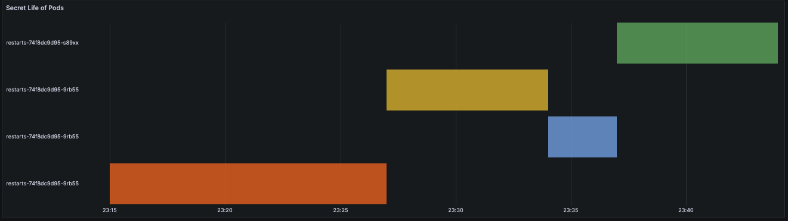

# Secret Life of Pods



## Install Helm Repos

```
helm repo add grafana https://raw.githubusercontent.com/AllezWiggo/medium_artefacts/main/Secret_Life_of_Pods/Helm/grafana

helm repo add prometheus https://raw.githubusercontent.com/AllezWiggo/medium_artefacts/main/Secret_Life_of_Pods/Helm/prometheus
```

## Install Helm Charts

Grafana

```
helm upgrade --install grafana grafana/grafana
```

Prometheus

Update the local host path if different using a local values file.

values.yaml:

```
storage:
  class: "manual"
  capacity: "10Mi"
  hostPath: "<custom folder path>"
```

```
helm upgrade --install prometheus prometheus/prometheus -f <path to local values.yaml>
```


